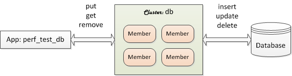
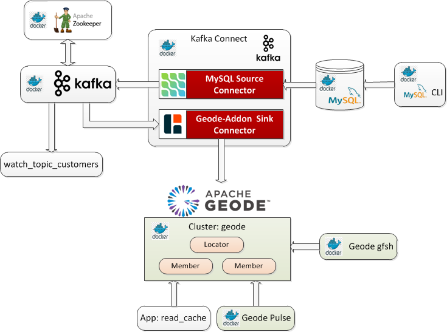
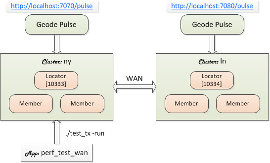

# Geode/GemFire Bundle Catalog - Use Cases

The online bundles can be installed by executing the `install_bundle` commands as shown below. To view use case details for each bundle, click on their image.

---

## DB Sync - Geode 1.11.x

```console
install_bundle -download bundle-geode-1.11.0-cluster-app-mysql-perf_test_mysql.tar.gz
```

[](help/bundle-geode-1.11.0-cluster-app-mysql-perf_test_mysql/README.md)

---

## Debezium-Kafka Geode/GemFire Connector - Geode 1.11.x

```console
install_bundle -download bundle-geode-1.11.0-docker-debezium_kafka.tar.gz
```

[](help/bundle-geode-1.11.0-docker-debezium_kafka/README.md)

---

## Power BI - Geode 1.11.x

```console
install_bundle -download bundle-geode-1.11.0-cluster-app-powerbi-perf_test_powerbi.tar.gz
```

[](help/bundle-geode-1.11.0-cluster-app-powerbi-perf_test_powerbi/README.md)

---

## WAN Bundle - Geode 1.11.x

```console
install_bundle -download bundle-geode-1.11.0-cluster-app-ln-ny-perf_test_wan.tar.gz
```

[](help/bundle-geode-1.11.0-cluster-app-ln-ny-perf_test_wan/README.md)
