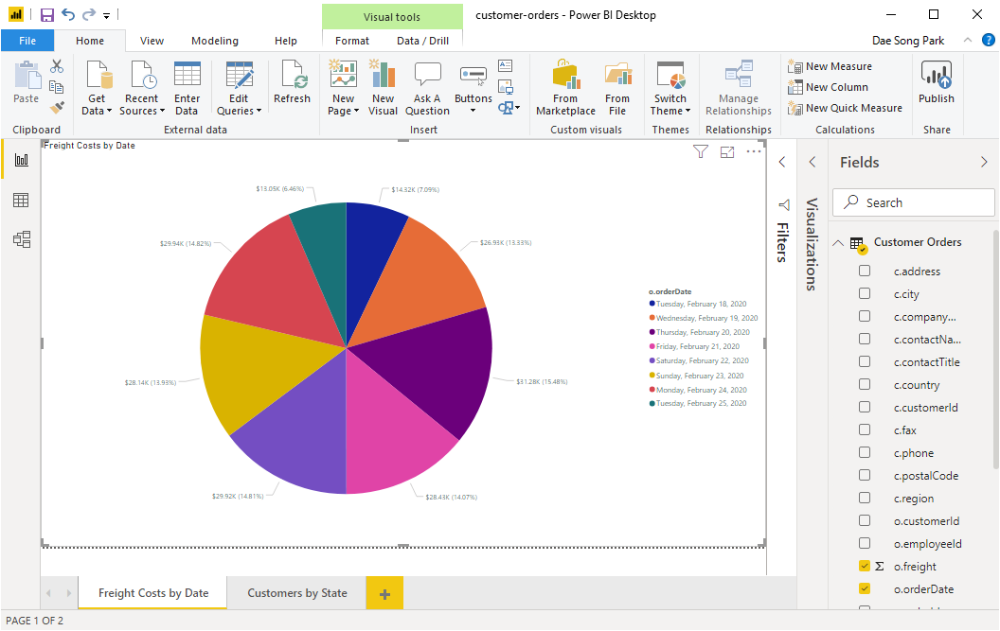

# Bundle: Power BI

This bundle contains a Microsoft Power BI example that interfaces Power BI with Geode/GemFire via the REST API. 

This article can be viewed in your browser by running the following:

```console
show_bundle bundle-geode-1.11.0-cluster-app-powerbi-perf_test-powerbi.tar.gz
```

## Installing Bundle

```console
install_bundle -download bundle-geode-1.11.0-cluster-app-powerbi-perf_test-powerbi.tar.gz
```

## Running Cluster

The bundle installs the `powerbi` cluster which can be started as follows:

```console
switch_cluster powerbi
start_cluster
```

## Running `perf_test_test` App

The bundle includes the `perf_test_powerbi` app that included the preconfigured `etc/group-factory.properties` for ingesting mock customer and order objects into the `powerbi` cluster that you started from the previous section.

Run the `test_group` command to ingest the data as follows:

```console
cd_app perf_test_power_bi; cd bin_sh
./test_group -prop ../etc/group-factory.properties -run
```

The above command ingests small sets of data as follows.

| Region        | Count |
| ------------- | ----- |
| /nw/customers | 100   |
| /nw/orders    | 1000  |

You can increase the number of entries in the `etc/group-factory.properties` file by changing group properties.

```console
cd_app perf_test_power_bi
vi etc/group-factory.properties
```

The following properties should be changed.

```properties
# customers 
g1.totalInvocationCount=100

# orders
g3.totalInvocationCount=1000

# If you changed the customer count then you should also consider changing the
# max number of customers to include them in the generated orders. This value is
# the upper bound of the customer ID that will be assigned to orders. If you want
# all of the customers to have orders then set it to the same value as g1.totalInvocationCount.
put2.factory.customerId.max=100
```

## Loading .pbix Files

The following `.pbix` files are included in the bundle. You can load them from the Power BI Desktop.

```console
cd_app perf_test_powerbi
tree etc/powerbi/
etc/powerbi/
├── customer-orders.pbix
└── nw.pbix
```

### customer-orders.pbix

This Power BI file interfaces Geode/GemFire using the function, `QueryFunction` provided by `geode-addon`. It queries customer and order objects by executing the following OQL query:

```sql
select * from /nw/customers c, /nw/orders o where c.customerId=o.customerId
```

To join Geode/GemFire regions, the regions must be colocated. The `powerbi` cluster has been preconfigured to colocate `/nw/customers` and `/nw/orders` regions using the generic partition resolver, `IdentityKeyPartitionResolver`, provided by `geode-addon`. To properly use `IdentityKeyPartitionResolver`, the entry key a composite string that contains the routing key separted by the default delimiter '.'. For our example, the routing key is the second token of the entry key string. For example, the order entry key, `k0000000920.000000-0055` contains the customer ID, `000000-0055` as the routing key.


### nw.pbix

This Power BI file interfaces Geode/GemFire using two separate queries as follows.

```sql
select * from /nw/customers
select * from /nw/orders
```

The results of the queries are then merged into one (1) table using Power Query M.

## Power BI Desktop

After loading the pbix files, click on the Home/Refresh icon in the tool bar. Since the query results for both pbix files are same, they should show the exact same *Freight Costs by Date* pie charts and *Customer by State* maps as shown below.

## Tearing Down

```console
stop_cluster -all
```

## Conclusion

Integrating Power BI with Geode/GemFire is a trivial task using the Geode/GemFire REST API. For simple queries and small result sets, the REST API provides you a quick and simple way to retrieve data in real time. However, the lack of OQL support for non-colocated data and the poor support for streaming large result sets greatly hamper its usability. The Geode/GemFire query service is not for those who need to execute complex queries and expect large result sets. For that, a separate data extraction service is needed. Stay tuned...


